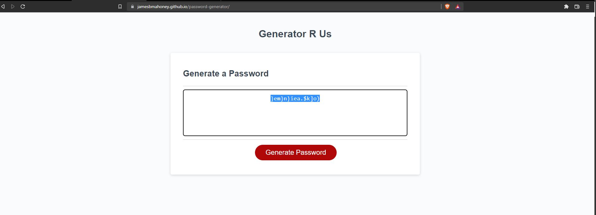
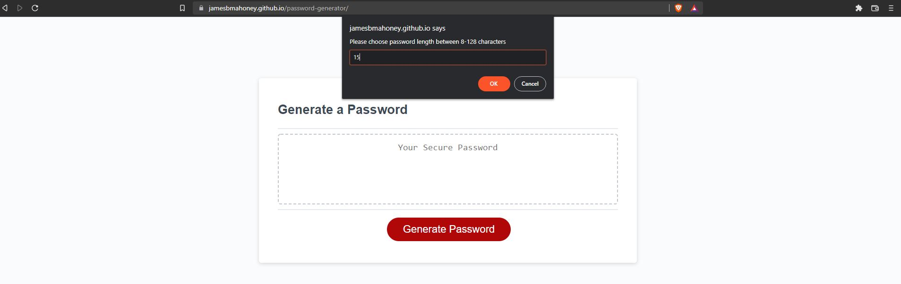

# Homework 3 - Password Generator

## Purpose

To create a password generator that takes in user feedback and gives out a unique password.  User is prompted to choose a length of a password followed by options to add lower case, upper case, numbers or symbols.  Once all prompts have been gone through, the site then provides a password based upon all the chosen criteria.

##  Made With

* HTML
* CSS
* Javascript

## Images 

## Website

https://jamesbmahoney.github.io/password-generator/